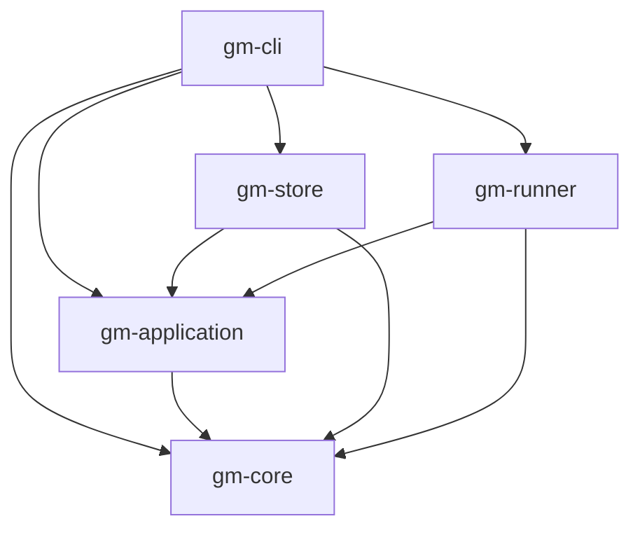

# generation-manager (`gm`)

개발 라이프사이클을 **worktree → 세대(generation) → 롤백** 세 단계로 관리하는 CLI.

NixOS의 세대/롤백 모델을 일반 프로젝트에 옮긴 것입니다. 다만 입력 해시 기반
재현성은 목표로 하지 않고, **번호가 매겨진 불변 스냅샷 + 원자적 심볼릭 링크 전환**
까지만 보장합니다.

```
1단계  gm worktree create <name>             원본을 건드리지 않는 격리된 worktree
       gm worktree run                       worktree 코드를 그 자리에서 실행 (개발 내부 루프)
2단계  gm generation build --activate        빌드 → 테스트 → 세대 생성 → 활성화 → 헬스체크
3단계  gm generation rollback                이전 세대로 복귀
```

헬스체크가 실패하면 `gm generation activate`가 **자동으로 이전 세대를 되돌리고** 종료 코드 1을
반환합니다. 이 자동 롤백이 도구의 핵심이며, 단순 배포 스크립트와의 차이입니다.

변경 이력은 [CHANGELOG.md](CHANGELOG.md)를 참고하세요.

## 요구 사항

- **Unix 계열 전용.** 프로세스 분리에 `setsid(2)`, 세대 전환에 심볼릭 링크와
  `rename(2)`을 씁니다. Windows는 지원하지 않습니다.
- 프로세스 소유권 확인은 Linux와 macOS를 지원합니다. Linux에서는 PID 재사용으로
  다른 프로세스를 종료하지 않도록 `pidfd`를 사용하며 **커널 6.9 이상**이 필요합니다.
- **git.** `gm worktree *` 명령이 `git worktree`를 직접 호출합니다. 그 외 명령은
  git 없이도 동작합니다.
- **Rust 2024 edition** 지원 툴체인.

## 설치

```bash
cargo build --release          # target/release/gm
cargo install --path crates/gm-cli
```

## 개발 스크립트

포맷팅 → 린팅(경고도 오류 처리) → 워크스페이스 빌드 → 테스트 → `gm` 실행을
순서대로 수행합니다. 실패한 단계에서 즉시 중단하고 해당 종료 코드를 반환합니다.
포맷팅은 소스 파일을 수정합니다.

```bash
bash scripts/run.sh                         # 마지막에 gm --help 실행
bash scripts/run.sh project status          # gm에 인자 전달
bash scripts/tests/run.sh                   # 스크립트 동작 검증
```

```powershell
./scripts/run.ps1
./scripts/run.ps1 project status
./scripts/tests/run.ps1                     # 전체 실행 및 경고 없음 검증
```

어느 디렉토리에서 호출해도 이 프로젝트 루트에서 실행합니다. 다른 프로젝트를
대상으로 하려면 `-C <DIR>`을 전달하세요.

Windows에서는 `run.ps1`이 기본 WSL 배포판의 Bash로 `run.sh`를 실행합니다.
WSL 안에 Rust와 git이 설치되어 있어야 하며, `rust-toolchain.toml`에 지정된
nightly 툴체인과 rustfmt/clippy를 사용합니다. Linux/macOS의 PowerShell에서도
같은 Bash 스크립트를 실행합니다.

## 빠른 시작

```bash
gm project init --preset rust             # generation-manager.toml 생성 (미지정 시 자동 감지)

gm worktree create add-cache              # 1단계: .gm/worktrees/add-cache + 동명 브랜치
cd .gm/worktrees/add-cache                #        개발
gm worktree run                           #        그 자리에서 실행 (전경, 검증 없음)
gm generation build --activate            # 2단계: 빌드, 테스트, 활성화, 검증

gm generation list                        # 세대 목록 (* 가 활성 세대)
gm project status                         # 프로젝트 전체 상태
gm service status                         # 실행 중인 서비스의 출처
gm service logs -n 100                    # 서비스 로그

gm generation rollback                    # 3단계: 바로 이전 세대로
gm generation prune --keep 5              # 오래된 세대 정리
```

## 명령어

모든 명령에 전역 옵션 `-C, --directory <DIR>`을 쓸 수 있습니다(해당 디렉토리에서
시작한 것처럼 동작).

| 명령 | 설명 |
| --- | --- |
| `gm project init [--preset P] [--name N] [--force]` | 매니페스트 생성. 프리셋 미지정 시 프로젝트 파일로 자동 감지 |
| `gm project status` | 프로젝트 루트, 활성 세대, 현재 worktree, 서비스 상태 요약 |
| `gm worktree create <name> [--base <ref>]` | worktree + 동명 브랜치 생성 |
| `gm worktree list` | worktree 목록 (`*` = 현재 서 있는 곳) |
| `gm worktree run [WORKTREE] [--no-build] [--detach]` | worktree 코드를 실행. 세대를 만들지 않음 |
| `gm worktree remove <name> [--force]` | worktree 제거 (브랜치는 남김) |
| `gm generation build [WORKTREE] [--note T] [--activate]` | 빌드와 테스트 후 세대 생성. `--activate`면 이어서 활성화 |
| `gm generation list` | 세대 목록. 상태는 `built` / `healthy` / `rejected` |
| `gm generation activate [GENERATION]` | 세대 활성화 + 검증 (기본: 가장 최근 세대) |
| `gm generation rollback [GENERATION]` | 이전 세대로 복귀 (기본: 활성 세대 바로 아래) |
| `gm generation history` | 활성화 이력과 사유 |
| `gm generation prune [--keep N]` | 오래된 세대 삭제 (기본 5). 활성 세대와 롤백 대상은 항상 보존 |
| `gm service status` | 실행 슬롯 상태와 실행 중인 소스 표시 |
| `gm service start` / `stop` / `restart` | 활성 세대의 프로세스 제어 |
| `gm service logs [-n N]` | 서비스 로그 꼬리 (기본 40줄) |

worktree 이름은 단일 디렉토리 이름이어야 합니다. `feature/cache`처럼 경로 구분자를
포함하는 이름은 생성·실행·빌드·제거 명령에서 거부합니다.

**종료 코드.** 검증에 실패해 자동 롤백된 `gm generation activate`와
`gm generation build --activate`는 `1`을 반환합니다. `gm worktree run`은
실행한 코드의 종료 코드를 그대로 전달합니다.

### worktree 안에서의 동작

`generation-manager.toml`은 커밋되어 있으므로 worktree에도 복사본이 있지만, `gm`은
`.gm/worktrees/<name>` 경로를 인식해 **항상 원본 프로젝트 루트를 기준으로**
동작합니다. worktree 안에 별도의 세대 저장소가 생기지 않습니다.

덕분에 worktree 안에서는 대상을 생략할 수 있습니다.

```bash
cd .gm/worktrees/add-cache
gm project status      # 원본의 활성 세대가 보임 + `worktree add-cache (you are here)`
gm worktree run        # 이 worktree를 실행
gm generation build   # 이 worktree를 빌드 (대상 인자 불필요)
```

## 실행 슬롯과 실행 출처

한 프로젝트는 **하나의 서비스 슬롯**만 가집니다. 슬롯을 차지한 주체는
`.gm/run/state.json`에 기록되므로, `gm project status`와 `gm service status`는
"뭔가 돌고 있다"가 아니라
**무엇이 돌고 있는지**를 답합니다.

```
  service      running (pid 15562, background)
  running      worktree `add-cache` (dev, unverified)   ← 세대가 아니라 개발 코드
```

| | `gm service start` / `gm generation activate` | `gm worktree run` |
| --- | --- | --- |
| 대상 | 활성 세대 (검증됨) | worktree (미검증) |
| 모드 | 배경 (setsid 분리) | 전경 (`--detach`로 배경) |
| 테스트 | 세대 생성 시 통과 | 건너뜀 |
| 헬스체크와 자동 롤백 | 함 | **안 함** |
| 종료 | `gm service stop` | Ctrl-C |

슬롯을 뺏을 때는 양쪽 모두 무엇을 밀어냈는지 출력합니다.

실행 상태에는 PID와 커널의 프로세스 시작 식별자를 함께 기록합니다. 이전 버전이
만든 상태 파일에 시작 식별자가 없으면 해당 PID를 종료하지 않습니다. 업그레이드
전에 기존 서비스를 종료하세요. 이미 업그레이드했다면 실제 기존 서비스를 직접
종료한 뒤 `.gm/run/state.json`을 제거하고 다시 시작하세요.

```
$ gm generation activate 1
  → stopping worktree `add-cache` (dev, unverified) to take the service slot
```

## 매니페스트

`generation-manager.toml`. 빌드, 테스트, 실행이 전부 shell 커맨드(`sh -c`)라 언어에
중립적입니다.

```toml
[project]
name = "demo"

[build]
cmd = "cargo build --release"
env = { RUSTFLAGS = "-C target-cpu=native" }   # 선택

[test]
cmd = "cargo test"                             # 생략하거나 비우면 건너뜀

[artifacts]
include = ["target/release/demo", "config"]    # 세대로 동결할 경로

[run]
cmd = "./target/release/demo"
env = { RUST_LOG = "info" }                    # 선택
stop_timeout_secs = 10                         # SIGTERM 후 SIGKILL까지 대기 (기본 10)

[health]
tcp = "127.0.0.1:8080"
timeout_secs = 30                              # 기본 30
interval_secs = 1                              # 기본 1
```

### 실행 디렉토리

`run.cmd`(그리고 `health.cmd`)의 작업 디렉토리는 다음과 같습니다.

- `gm service start` / `gm generation activate` → 세대의 payload (`.gm/store/NNNN-xxx/root`)
- `gm worktree run` → 해당 worktree 루트

payload는 **빌드 디렉토리의 상대 경로 구조를 그대로 복사**한 것이라, 두 경우에
같은 명령이 성립합니다. 따라서 `run.cmd`는 빌드 디렉토리 기준 상대 경로로
쓰면 되고, 실행 모드별로 설정을 나눌 필요가 없습니다.

`artifacts.include`의 항목도 빌드 디렉토리 기준 상대 경로여야 하며, `..`로
바깥을 가리킬 수 없습니다.

심볼릭 링크는 빌드 디렉토리 내부의 대상을 실제 파일로 복사합니다. 외부를 가리키는
링크, 디렉토리 순환, 저장 목적지를 포함하는 경로(`include = ["."]` 등)는 거부합니다.

### 헬스체크

세 가지 프로브를 쓸 수 있고, **여러 개를 두면 전부 통과해야** 정상으로 봅니다.

| 키 | 의미 |
| --- | --- |
| `tcp = "host:port"` | TCP 연결 성공 |
| `http = "http://host:port/path"` | 2xx/3xx 응답 (평문 HTTP 전용) |
| `cmd = "..."` | 종료 코드 0 |

`timeout_secs` 안에 통과하지 못하면 활성화를 되돌립니다. `[health]`를 아예
생략하면 검증 없이 활성화만 하며, **자동 롤백도 일어나지 않습니다.**

### 프리셋

`gm project init --preset <name>`. 미지정 시 `Cargo.toml` / `package.json` / `go.mod` /
`pyproject.toml`(또는 `requirements.txt`)을 보고 고릅니다.

`rust`, `node`, `python`, `go`, `generic`

프리셋은 출발점일 뿐이므로, 생성된 매니페스트의 명령과 산출물 경로는 프로젝트에
맞게 손봐야 합니다.

## 상태 레이아웃

파일시스템이 유일한 진실의 원천입니다. 데이터베이스는 없습니다.

```
.gm/
├── worktrees/<name>/            개발용 git worktree
├── store/0007-a1b2c3d/          불변 산출물(root/) + meta.json
├── generations/0007 -> ../store/0007-a1b2c3d
├── current -> generations/0007  활성 포인터 (rename(2)으로 원자적 교체)
├── history.jsonl                전환 감사 로그
├── run/state.json               실행 중인 pid + 그 출처(세대/worktree)
├── run/service.log
└── lock                         프로젝트 단위 배타 잠금
```

`current` 교체는 임시 심볼릭 링크 생성 후 `rename(2)`입니다. `ln -sfn`은
unlink와 symlink 사이에 활성 세대가 없는 구간이 생기므로 쓰지 않습니다.

`.gm/`은 프로젝트의 `.gitignore`에 넣으세요.

## 크레이트 구성

하나의 Cargo Workspace에서 도메인, 애플리케이션, 어댑터, CLI를 각각 독립된
크레이트로 관리합니다. 순수한 계산은 `gm-core`에, 실행 순서는 `gm-application`에,
실제 부수효과는 `gm-store`와 `gm-runner`에 있습니다. CLI가 구체적인 구현을
선택해 연결합니다.

| 크레이트 | 역할 |
| --- | --- |
| `gm-core` | 도메인 타입, 설정 검증, 프리셋, 세대 번호·롤백·GC 정책. I/O와 TOML 의존성 없음 |
| `gm-application` | 빌드·활성화·서비스 시작/재시작·worktree 생성/제거/실행 유스케이스와 포트 |
| `gm-store` | TOML/JSON, 프로젝트 발견과 경로, 세대·실행 상태 저장, 원자적 전환, 파일 잠금 |
| `gm-runner` | 셸·Git·프로세스·터미널·시계·산출물 복사·네트워크 헬스체크 어댑터 |
| `gm-cli` | 인자 파싱, 잠금 범위, 어댑터 조립, 출력과 종료 코드 |

화살표는 Cargo 의존 방향입니다. 어댑터끼리는 의존하지 않으며, 안쪽 계층은
바깥 계층을 참조하지 않습니다.



```text
crates/
├── gm-core/src/          config, generation, run, policy
├── gm-application/src/   ports, build, activate, service, worktree
├── gm-store/src/         project, layout, lock, store, run_state
├── gm-runner/src/        exec, git, artifacts, supervisor, process, health, clock
└── gm-cli/src/           main, ui, cmd/composition, 각 명령의 입출력
```

`gm-core`는 파일 존재 여부도 직접 확인하지 않습니다. 예를 들어 프리셋 선택은
어댑터가 수집한 `DetectedFiles` 값으로 계산합니다. `gm-application`은 순수 함수만
모아 둔 계층은 아니며, 부수효과를 포트로 요청하는 유스케이스 계층입니다. 실제
파일·프로세스·네트워크·현재 시각 구현을 포함하지 않으므로 가짜 포트로 실행
순서와 실패 처리를 검사할 수 있습니다.

저장과 실행의 경계는 `RunStateRepository`입니다. `Supervisor`는 JSON이나 `.gm`
경로, 파일 잠금 구현을 알지 못합니다. `FileRunState`가 상태를 원자적으로 저장하고,
완료된 전경 실행의 상태를 지울 때 잠금을 획득해 PID·프로세스 식별자·시작 시각이
모두 일치하는지 확인합니다. CLI는 실행 슬롯 기록 후 잠금을 해제하고 전경 실행을
기다리므로 다른 명령이 슬롯을 인계받을 수 있습니다.

조립 지점은 `gm-cli/src/cmd/composition.rs`입니다. 빌드·활성화에는 잠금을 보유한
`StoreRepository`와 실행 어댑터를 전달하고, supervisor에는 `FileRunState`를 주입합니다.
새 정책은 도메인이나 애플리케이션에, 외부 시스템 구현은 어댑터에 추가하세요.
`tests/architecture.rs`가 Workspace의 의존 방향을 검사합니다.

CLI 명령, 매니페스트 및 `.gm` 저장 형식은 유지되어 데이터 마이그레이션이 필요하지
않습니다. 라이브러리를 직접 호출하는 코드는 바뀐 API를 적용해야 합니다.
`Config::parse`/`to_toml`은 `gm-store::parse_config`/`render_config`로 옮겼고,
`gm-runner::Pipeline`은 제거했습니다. 빌드·활성화는 애플리케이션 함수를 호출하고,
`Supervisor::new`에는 실행 상태 저장 포트와 로그 경로를 전달합니다.

## 설계상의 선택과 한계

- **재현성 아님.** 커밋 해시와 dirty 여부를 기록할 뿐, 같은 입력이 같은 출력을
  낸다고 보장하지 않습니다. 그건 Nix의 일입니다.
- **로컬 프로세스 하나.** supervisor는 상태 파일 하나, 로그 파일 하나입니다.
  재부팅 후 복구나 다중 서비스는 범위 밖이며, `Supervisor`가 systemd 백엔드를
  붙일 자리입니다.
- **산출물은 복사.** worktree에서 이후 개발을 해도 과거 세대가 바뀌지 않도록
  하드링크가 아닌 복사를 씁니다. 산출물이 크면 reflink 도입 여지가 있습니다.
- **git은 CLI 호출.** `git worktree` 지원은 libgit2 쪽이 어정쩡해서 `git`을
  직접 실행합니다.
- **`gm worktree run`은 검증하지 않습니다.** 아직 안 되는 코드를 돌려보는 게 목적이라
  헬스체크와 자동 롤백을 일부러 뺐습니다. 검증이 필요하면 세대를 만드세요.
- **헬스체크 HTTP는 평문 전용.** 대상이 로컬 프로세스라 TLS 스택을 넣지
  않았습니다. `https://`는 `tcp` 또는 `cmd` 프로브로 대체하세요.
- **헬스체크는 프로세스 생존을 보지 않습니다.** `cmd = "true"`처럼 항상 통과하는
  프로브는 프로세스가 이미 죽었어도 정상으로 판정합니다. 실제 서비스 상태를
  보는 프로브를 쓰세요.

## 테스트

```bash
cargo test --workspace
```

라이브러리 단위 테스트와, 실제 `gm` 바이너리를 구동하는 CLI 통합 테스트로 나뉩니다.

| 대상 | 내용 |
| --- | --- |
| `gm-core` | 설정·이름 검증, 프리셋 선택, 세대 번호, 롤백 및 GC 정책 |
| `gm-application` | 가짜 포트로 활성화·롤백, 서비스 재시작, worktree 정책과 실패 시 실행 순서 검사 |
| `gm-store` | 설정 변환, worktree 경로 판별, 원자적 전환, GC, 잠금 및 교체된 실행 상태 보존 |
| `gm-runner` | HTTP/명령 프로브 제한 시간, 프로세스 소유권과 자식 정리, 전경 실행 슬롯 인계 |
| `tests/architecture.rs` | Cargo 의존 방향과 어댑터 간 의존 금지 |
| `tests/worktree.rs` | `project init`, `worktree create/list/remove`, worktree 안에서의 발견 동작 |
| `tests/dev_run.rs` | `worktree run` — 전경 실행, 종료 코드, 빌드 단계, 대상 자동 선택, 슬롯 인계 |
| `tests/lifecycle.rs` | `generation build/list/activate/rollback/history/prune` |
| `tests/service.rs` | `project status`, `service status/start/stop/restart/logs`, `-C` |

통합 테스트는 임시 디렉토리에 프로젝트를 만들고 실제 프로세스를 띄웁니다.
git이 필요한 것은 `tests/worktree.rs`뿐입니다.
