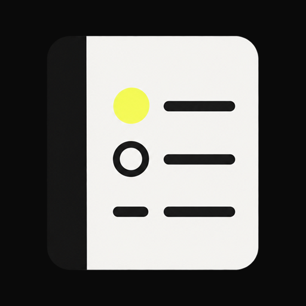

# Stillnote launcher icon

The original notebook emblem combines the app's charcoal (`#0A0A0A`), ivory
(`#F7F7F5`) and lime (`#FAFF69`) palette with rapid logging's task dot, event
circle and note dash. The concept refers to Ryder Carroll's *The Bullet Journal
Method* through the author's [official rapid logging explanation](https://bulletjournal.com/blogs/faq/what-is-rapid-logging-understand-rapid-logging-bullets-and-signifiers),
rather than reproducing a book cover or the official Bullet Journal logo.



## Assets and integration

- `assets/stillnote-icon-source.png`: original transparent image from the built-in
  ImageGen tool; retained for future packaging.
- `assets/stillnote-icon-preview.png`: opaque 512px preview of the 72dp launcher
  viewport, before the launcher's shape mask.
- `../app/res/drawable-{mdpi,hdpi,xhdpi,xxhdpi,xxxhdpi}/ic_launcher_foreground.png`:
  108dp foreground at each density, with centered 50 x 55.22dp artwork.
- `../app/res/drawable/ic_launcher_monochrome.xml`: vector silhouette with cutout
  rapid-log marks for system themed icons.
- `../app/res/mipmap-anydpi-v26/ic_launcher.xml`: adaptive icon shared by the
  manifest's `android:icon` and `android:roundIcon`, with a charcoal background.

The app's minimum API is 36, so every supported device uses the adaptive icon.
Foreground sizing follows Android's [adaptive icon guidance](https://developer.android.com/develop/ui/compose/system/icon_design_adaptive).
The monochrome layer is a simplified rendition designed for launcher tinting.
To regenerate density assets and the preview on Windows:

```powershell
./scripts/package-launcher-icon.ps1
```

Packaging uses System.Drawing only to trim transparent padding, resize and
center the generated image; it does not redraw the artwork.

## Generation prompt

Mode: built-in ImageGen, `transparent_background: true`.

```text
Use case: logo-brand. Asset type: production Android adaptive launcher icon foreground for Stillnote, an offline minimalist bullet journal app. Create one square transparent PNG. A single beautifully simple front-facing journal/notebook emblem, pale warm ivory #F7F7F5 cover with very subtly rounded corners, dark charcoal #0A0A0A spine down the left. On the cover exactly three bold minimal rapid-log rows: a lime #FAFF69 filled task bullet with a short charcoal horizontal line, a charcoal hollow event circle with a short charcoal line, and a charcoal dash with a short charcoal line. Calm intentional balanced editorial design, crisp flat solid shapes, strong recognizable silhouette at 48px, minimal depth, no photographic texture. The notebook must be centered and occupy approximately 48% of canvas width and 56% of canvas height; all artwork including any subtle edge entirely within central 60% square to survive Android launcher circular cropping. Surrounding canvas truly transparent. No text, letters, numbers, watermark, pens, checkmarks, book title, official Bullet Journal logo, extra objects, outer tile, or baked rounded-square background. This is original Stillnote branding inspired by rapid logging, not a reproduction of a book cover.
```
